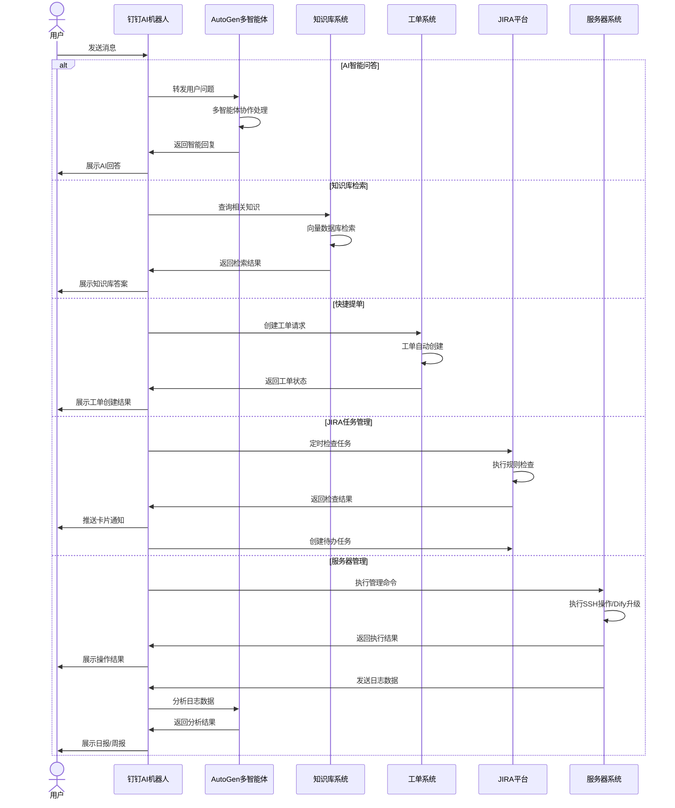

# 钉钉AI机器人

## 📝 项目概述

一个基于钉钉开放平台的智能机器人系统，集成AI问答、知识库检索、JIRA任务管理和服务器维护功能。使用Python 3.12和FastAPI构建，采用微软AutoGen框架实现智能化交互。

## 🚀 主要功能



### 核心功能

1. **机器人AI智能问答和回复**
   - 基于微软AutoGen多智能体架构
   - 支持上下文理解和连续对话

2. **知识库检索问答**
   - 支持对接企业知识库
   - 提供精准信息检索和回答

3. **快捷提单功能**
   - 群聊中快速创建工单
   - 自定义模板支持

4. **JIRA任务管理**
   - 定时检查JIRA任务规范性
   - 群内推送卡片通知
   - 自动创建相关人员待办

5. **服务器维护助手**
   - SSH远程操作支持
   - Dify服务自动化升级
   - AI驱动的日志分析与总结

6. **AI智能日报/周报**
   - 每天的日报，AI智能分析
   - 每周五根据本周的每天的日报，生成本周的周报（AI智能分析）
   - 生成后定时定点推送

## 🛠️ 技术架构

- **后端框架**：FastAPI
- **智能体引擎**：Microsoft AutoGen
- **依赖管理**：uv (Python包管理工具)
- **开发环境**：Python 3.12+
- **平台集成**：钉钉开放平台、JIRA API

## 🔧 安装与配置

### 环境要求

- Python 3.12+
- uv (推荐的包管理工具)

### 安装步骤

1. 克隆仓库

```bash
git clone [仓库地址]
cd dingtalk-ai-robot
```

2. 安装依赖

```bash
# 使用uv安装依赖
uv pip install -e .

# 或者使用传统方式
uv pip compile pyproject.toml -o requirements.txt
pip install -r requirements.txt
```

3. 配置环境变量

创建`.env`文件，参考`.env.example`中的示例，配置必要的环境变量。

### 启动服务

```bash
# 使用uv运行
uv run -m app.main

# 或者使用传统方式
python -m app.main
```

## 📚 使用指南

### 机器人配置

1. 在[钉钉开发者平台](https://open-dev.dingtalk.com)创建机器人应用
2. 配置机器人权限和回调地址
3. 获取ClientID、ClientSecret和RobotCode

### 功能使用

1. **AI问答**：在群聊中@机器人并提问
2. **知识库检索**：使用特定指令触发知识库搜索
3. **提单功能**：按格式发送提单信息
4. **JIRA管理**：系统自动执行定时检查
5. **服务器维护**：使用指定命令触发服务器操作

## 🧩 项目结构

```
dingtalk-ai-robot/
├── app/                    # 主应用目录
│   ├── api/                # API端点
│   ├── core/               # 核心配置和功能
│   ├── services/           # 服务模块
│   │   ├── ai/             # AI智能体
│   │   ├── dingtalk/       # 钉钉API集成
│   │   ├── jira/           # JIRA服务
│   │   ├── knowledge/      # 知识库服务
│   │   └── ssh/            # SSH服务
│   └── main.py             # 应用入口
├── tests/                  # 测试目录
├── .env.example            # 环境变量示例
├── pyproject.toml          # 项目配置和依赖
├── CHANGELOG.md            # 变更日志
└── README.md               # 项目说明
```

## 🧠 本地知识检索器 (`KnowledgeRetriever`)

`KnowledgeRetriever` 服务提供了使用文本嵌入来构建和查询本地知识库的功能。它利用微软 AutoGen 的 `ChromaDBVectorMemory` 进行持久化向量存储，并使用自定义的 `TongyiQWenHttpEmbeddingFunction` 通过通义千问 V3 文本嵌入 API (HTTP端点) 生成嵌入。这种方法避免了对嵌入模型的直接SDK依赖。

### ✨ 特性

-   **异步操作**: 完全异步的设计，用于初始化、文档添加、搜索和资源清理，适用于AutoGen多智能体系统。
-   **自定义通义千问嵌入**: 使用 `aiohttp` 直接调用通义千问嵌入API，确保了嵌入生成的灵活性并最小化外部依赖。
-   **持久化向量存储**: 使用 `ChromaDBVectorMemory` 进行持久化存储，允许知识库在不同会话间保存和加载。
-   **可配置性**: 关键参数（如API密钥、模型名称、API端点和数据库路径）通过 `app.core.config.settings` 和环境变量进行管理。
-   **嵌入一致性**: 确保在索引文档和查询时使用相同的嵌入模型，这对于检索准确性至关重要。
-   **批量嵌入效率**: 利用通义千问API的批量嵌入能力，提高处理多个文档时的性能。

### 🛠️ 配置

`KnowledgeRetriever` 依赖以下配置 (通常通过环境变量或由 `pydantic-settings` 加载的 `.env` 文件进行配置):

-   `TONGYI_API_KEY`: 你的通义千问API密钥。
-   `TONGYI_EMBEDDING_MODEL_NAME`: 要使用的特定通义嵌入模型 (例如，`text-embedding-v4`)。默认为 `"text-embedding-v4"`。
-   `TONGYI_EMBEDDING_API_ENDPOINT`: 通义嵌入API的HTTP端点。默认为 `"https://dashscope.aliyuncs.com/compatible-mode/v1/embeddings"`。
-   `VECTOR_DB_PATH`: ChromaDB持久化其数据的本地文件系统路径。默认为 `"./.chroma_test_db"` (如示例中使用，可以配置)。

### 🏗️ Architecture and Data Flow

```mermaid
graph TD
    A[USER/Application] --> KR{KnowledgeRetriever};

    subgraph KnowledgeRetriever [KnowledgeRetriever Service]
        direction LR
        KR_Init[initialize()] --> EF{                               };
        KR_Init --> VM{ChromaDBVectorMemory};
        EF -.-> HTTP_API[Tongyi QWen HTTP API];
        EF --> AIOHTTP[aiohttp.ClientSession];
        VM -.-> DB[ChromaDB Persistent Storage];
    end
    
    Settings[app.core.config.settings] -.-> KR_Init;
    Settings -.-> EF;

    A -- Add Documents (List<Dict>) --> KR_Add[add_documents()];
    KR_Add -- Texts to Embed --> EF;
    EF -- Embeddings --> KR_Add;
    KR_Add -- MemoryContent to Add --> VM;
    
    A -- Search(query_text) --> KR_Search[search()];
    KR_Search -- Query to Embed --> EF;
    EF -- Query Embedding --> KR_Search;
    KR_Search -- Embedded Query --> VM;
    VM -- MemoryQueryResult --> KR_Search;
    KR_Search -- Formatted Results (List<Dict>) --> A;

    A -- Close --> KR_Close[close()];
    KR_Close --> EF_Close[EF.close_session()];
    EF_Close --> AIOHTTP;
    KR_Close --> VM_Close[VM.close()];

    style A fill:#f9f,stroke:#333,stroke-width:2px
    style KR fill:#bbf,stroke:#333,stroke-width:2px
    style HTTP_API fill:#ff9,stroke:#333,stroke-width:2px
    style DB fill:#9cf,stroke:#333,stroke-width:2px
    style Settings fill:#lightgrey,stroke:#333,stroke-width:2px
```

### 📦 Dependencies

-   `autogen-core`
-   `autogen-extensions` (specifically for `ChromaDBVectorMemory`)
-   `chromadb`
-   `aiohttp` (newly added for HTTP calls to Tongyi API)
-   `loguru`
-   `pydantic`

### 🚀 Example Usage

(Adapted from `app/services/knowledge/retriever.py`)

```python
import asyncio
from app.services.knowledge.retriever import KnowledgeRetriever
from app.core.config import settings # Ensure settings are loaded

async def main():
    # Ensure TONGYI_API_KEY is set in your environment or .env file
    if not settings.TONGYI_API_KEY:
        print("示例用法中止：请配置通义千问API密钥。")
        return

    retriever = KnowledgeRetriever(
        collection_name="my_knowledge_base",
        persistence_path="./.my_chroma_db", # Example path
        tongyi_api_key=settings.TONGYI_API_KEY,
        tongyi_api_endpoint=settings.TONGYI_EMBEDDING_API_ENDPOINT,
        embedding_model_name=settings.TONGYI_EMBEDDING_MODEL_NAME
    )

    try:
        await retriever.initialize()
        print("KnowledgeRetriever initialized.")

        documents_to_add = [
            {"content": "AutoGen is a framework for building multi-agent applications.", "metadata": {"source": "doc1"}},
            {"content": "ChromaDB is a vector store used for similarity search.", "metadata": {"source": "doc2"}},
            {"content": "The Tongyi QWen API provides powerful text embedding models.", "metadata": {"source": "doc3"}},
        ]
        await retriever.add_documents(documents_to_add)
        print(f"Added {len(documents_to_add)} documents.")

        query1 = "What is AutoGen?"
        results1 = await retriever.search(query1)
        print(f"Search results for '{query1}':")
        for res in results1:
            print(f"  Content: {res['content']}, Metadata: {res['metadata']}")

        query2 = "Tell me about vector databases."
        results2 = await retriever.search(query2)
        print(f"Search results for '{query2}':")
        for res in results2:
            print(f"  Content: {res['content']}, Metadata: {res['metadata']}")

    except Exception as e:
        print(f"An error occurred: {e}")
    finally:
        await retriever.close()
        print("KnowledgeRetriever closed.")

if __name__ == "__main__":
    asyncio.run(main())
```

## 📋 开发计划

- [ ] 机器人AI智能问答和回复
- [ ] 机器人问答可以对接知识库进行检索回复
- [ ] 快捷批量提单功能的集成
- [ ] 定时检查组内JIRA单符合标准规则
  - [ ] 群内推送卡片形态
  - [ ] 创建对应人的待办
- [ ] 对话机器人可以自动智能升级多台服务器的Dify服务
- [ ] 每周五根据本周的每天的日报，生成本周的周报（AI智能分析）

## 🤝 贡献指南

欢迎提交问题报告、功能请求或代码贡献。请确保遵循项目的代码规范和提交流程。

## 📄 许可证

[MIT License](LICENSE)

## 📤 文档上传接口 (`/upload_document`)

机器人支持将本地文档嵌入到知识库，目前支持 **txt / pdf / docx / md** 四种格式。

```http
POST /api/v1/upload_document
Content-Type: multipart/form-data

# form-data 字段
file=<本地文件>
collection=<可选，自定义集合名，默认 global_knowledge_base>
chunk_size=<可选，默认 1500>
overlap=<可选，默认 200>
```

成功响应示例
```json
{
  "code": 0,
  "msg": "uploaded & embedded 12 chunks",
  "data": {
    "collection": "global_knowledge_base",
    "doc_id": "f6e21..."
  }
}
```

> 📌 默认切片策略为 **自然段 + 滑窗**，可通过 `chunk_size / overlap` 覆盖。

## ⚙️ LLM 配置注意事项

自 **AutoGen 0.6+** 起，若一次对话中包含多条且不连续的 *system* prompt，需要在 `model_info` 中显式开启：

```python
"multiple_system_messages": True
```

本项目已在 `app/services/ai/openai_client.py` 中设置，避免出现
`ValueError: Multiple and Not continuous system messages ...`。
