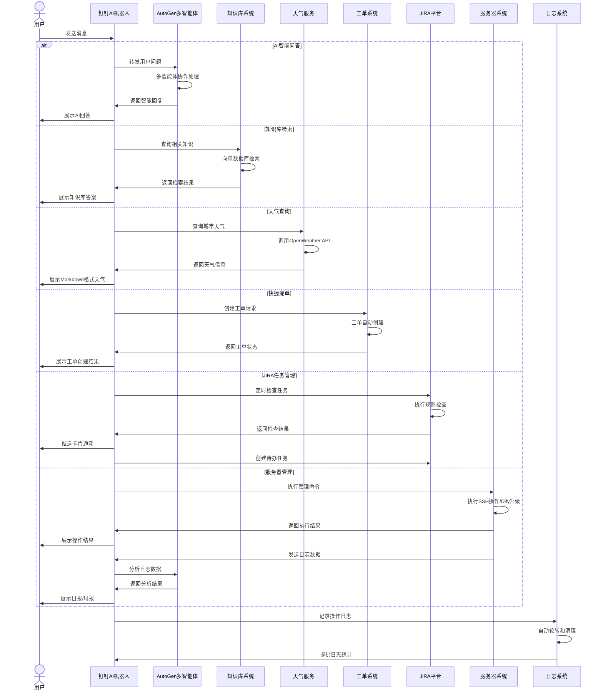
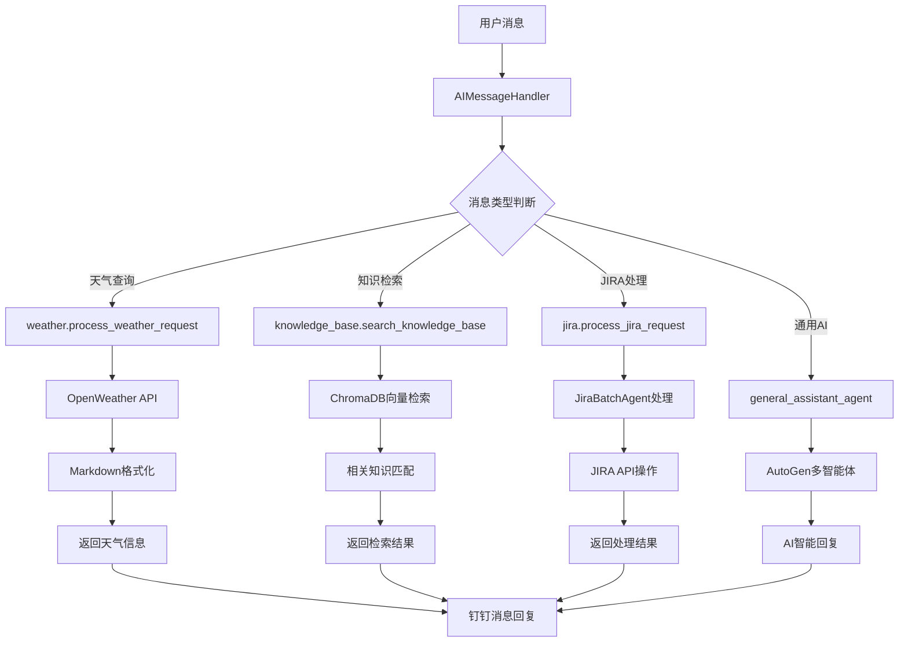

# 钉钉AI机器人

## 📝 项目概述

一个基于钉钉开放平台的智能机器人系统，集成AI问答、知识库检索、天气查询、JIRA任务管理和服务器维护功能。使用Python 3.12和FastAPI构建，采用微软AutoGen框架实现智能化交互。

## 🚀 主要功能



### 核心功能

1. **机器人AI智能问答和回复**
   - 基于微软AutoGen多智能体架构
   - 支持上下文理解和连续对话

2. **知识库检索问答**
   - 支持对接企业知识库
   - 提供精准信息检索和回答

3. **天气查询**
   - 支持实时天气信息查询
   - 支持Markdown格式天气信息展示

4. **本地数据库查询与分析**
   - SQLTeamAgent：自然语言 ➜ SQL ➜ Markdown 结果
   - 元数据表 `columns_comment` 支持字段级备注

5. **快捷提单功能**
   - 群聊中快速创建工单
   - 自定义模板支持

6. **JIRA任务管理**
   - 定时检查JIRA任务规范性
   - 群内推送卡片通知
   - 自动创建相关人员待办

6. **服务器维护助手**
   - SSH远程操作支持
   - Dify服务自动化升级
   - AI驱动的日志分析与总结

7. **AI智能日报/周报**
   - 每天的日报，AI智能分析
   - 每周五根据本周的每天的日报，生成本周的周报（AI智能分析）
   - 生成后定时定点推送

8. **日志管理系统**
   - 自动日志轮转（10MB轮转）
   - 定期清理（保留7天）
   - 分级记录（主日志+错误日志）
   - API管理接口

## 🛠️ 技术架构

- **后端框架**：FastAPI
- **智能体引擎**：Microsoft AutoGen
- **日志系统**：Loguru + 自动轮转
- **依赖管理**：uv (Python包管理工具)
- **开发环境**：Python 3.12+
- **平台集成**：钉钉开放平台、JIRA API、OpenWeather API

## 🔧 安装与配置

### 环境要求

- Python 3.12+
- uv (推荐的包管理工具)

### 安装步骤

1. 克隆仓库

```bash
git clone [仓库地址]
cd dingtalk-ai-robot
```

2. 安装依赖

```bash
# 使用uv安装依赖
uv pip install -e .

# 或者使用传统方式
uv pip compile pyproject.toml -o requirements.txt
pip install -r requirements.txt
```

3. 初始化日志目录

```bash
# 初始化日志目录结构
python scripts/init_logs.py
```

4. 配置环境变量

创建`.env`文件，参考`.env.example`中的示例，配置必要的环境变量。

### 启动服务

```bash
# 使用uv运行
uv run -m app.main

# 或者使用传统方式
python -m app.main
```

## 📚 使用指南

### 机器人配置

1. 在[钉钉开发者平台](https://open-dev.dingtalk.com)创建机器人应用
2. 配置机器人权限和回调地址
3. 获取ClientID、ClientSecret和RobotCode

### 功能使用

1. **AI问答**：在群聊中@机器人并提问
2. **知识库检索**：使用特定指令触发知识库搜索
3. **天气查询**：使用特定指令触发天气信息查询
4. **提单功能**：按格式发送提单信息
5. **JIRA管理**：系统自动执行定时检查
6. **服务器维护**：使用指定命令触发服务器操作
7. **周报管理**：自动化周报生成和钉钉日报推送

### 日志管理

1. **查看日志统计**：`GET /api/logs/stats`
2. **手动清理日志**：`POST /api/logs/cleanup`
3. **健康检查**：`GET /api/logs/health`

### 周报管理

#### 🤖 自动化周报功能

系统每周六20:30自动执行周报生成任务，包含以下流程：

1. **日志收集**：通过钉钉API查询本周一到周四的用户日报记录
2. **AI总结**：使用AutoGen双智能体协作生成专业周报
3. **钉钉推送**：自动创建钉钉日报并发送到群聊
4. **状态通知**：任务执行结果通过钉钉机器人通知

#### 📋 API接口

1. **查询钉钉日报记录**：`GET /api/v1/weekly-report/check-logs`
   - 直接调用钉钉API获取用户日报记录
   - 支持可选的日期范围参数
   - 返回整合后的日报内容

2. **查询本地已发送周报**：`GET /api/v1/weekly-report/local-reports`
   - 查询本地数据库中已发送成功的周报记录
   - 支持按用户ID和日期范围过滤
   - 返回已发送周报的详细信息

3. **生成周报总结**：`POST /api/v1/weekly-report/generate-summary`
   ```json
   {
     "content": "原始日志内容",
     "use_quick_mode": false
   }
   ```

4. **创建钉钉日报**：`POST /api/v1/weekly-report/create-report` ⭐ **已改造**
   ```json
   {
     "summary_content": "周报总结内容",
     "user_id": "可选用户ID",
     "template_name": "产品研发中心组长日报及周报(导入上篇)",
     "template_content": "可选的额外模版内容，用于AI智能体增强"
   }
   ```

   **改造亮点**：
   - ✅ 使用模版名称替代模版ID，更直观易用
   - ✅ 自动调用钉钉API获取模版详情信息
   - ✅ 根据模版字段动态格式化内容
   - ✅ 智能识别"上周工作"字段并转换为列表格式
   - ✅ 支持额外模版内容的AI智能体增强

5. **保存钉钉日报内容**：`POST /api/v1/weekly-report/save-report` 🆕 **新增**
   ```json
   {
     "summary_content": "日志内容",
     "user_id": "可选用户ID",
     "template_name": "产品研发中心组长日报及周报(导入上篇)",
     "template_content": "可选的额外模版内容，用于AI智能体增强"
   }
   ```

   **功能说明**：
   - ✅ 将内容保存为钉钉日报（不发送到群聊）
   - ✅ 使用与创建日报相同的模版格式化逻辑
   - ✅ 支持所有创建日报的高级特性
   - ✅ 适用于需要保存但暂不发送的场景

5. **执行自动任务**：`POST /api/weekly-report/auto-task`
   - 执行完整的自动周报流程
   - 通常由定时任务调用

6. **健康检查**：`GET /api/weekly-report/health`
   - 检查周报服务各组件状态

#### 🎯 智能体架构

周报生成采用AutoGen RoundRobinGroupChat双智能体协作：

- **总结智能体**：负责分析日志内容，生成结构化周报
- **检察官智能体**：审核总结质量，确保专业性和准确性

支持两种模式：
- **标准模式**：双智能体协作，质量更高
- **快速模式**：单智能体生成，速度更快

#### 🔄 最新改造功能

**智能模版适配系统** (2025-07-22 新增)

- **动态模版获取**：根据模版名称自动调用钉钉API获取模版详情
- **智能字段匹配**：支持精确匹配、映射匹配、模糊匹配三种策略
- **上周工作列表化**：自动识别并转换"上周工作"相关字段为列表格式
- **AI内容增强**：支持额外模版内容，调用周报智能体生成最终版本
- **向下兼容**：保持原有API结构，支持无模版字段的默认格式化

**使用示例**：
```json
// 基础使用
{
  "summary_content": "### 本周工作完成情况\n- 完成了功能开发",
  "template_name": "产品研发中心组长日报及周报(导入上篇)"
}

// AI增强使用
{
  "summary_content": "### 本周工作完成情况\n- 完成了功能开发",
  "template_name": "产品研发中心组长日报及周报(导入上篇)",
  "template_content": "请重点突出项目进展和风险控制"
}
```

## 🧩 项目结构

```
dingtalk-ai-robot/
├── app/                    # 主应用目录
│   ├── api/                # API端点
│   │   ├── v1/             # API版本1
│   │   │   ├── logs.py     # 日志管理API
│   │   │   └── ...         # 其他API模块
│   │   └── router.py       # 主路由
│   ├── core/               # 核心配置和功能
│   │   ├── logger.py       # 日志配置模块
│   │   ├── scheduler.py    # 定时任务调度器
│   │   └── ...             # 其他核心模块
│   ├── services/           # 服务模块
│   │   ├── ai/             # AI智能体
│   │   │   ├── agent/      # 智能体实现
│   │   │   ├── tools/      # AI工具模块
│   │   │   │   ├── __init__.py      # 统一导出中心
│   │   │   │   ├── weather.py       # 天气查询工具
│   │   │   │   ├── knowledge_base.py # 知识库检索工具
│   │   │   │   ├── jira.py          # JIRA处理工具
│   │   │   │   └── jira_bulk_creator.py # JIRA批量创建工具
│   │   │   └── handler.py  # AI消息处理器
│   │   ├── dingtalk/       # 钉钉API集成
│   │   ├── jira/           # JIRA服务
│   │   ├── knowledge/      # 知识库服务
│   │   ├── ssh/            # SSH服务
│   │   └── weather/        # 天气服务
│   └── main.py             # 应用入口
├── logs/                   # 日志目录
│   ├── .gitkeep           # 保持目录结构
│   ├── .gitignore         # 忽略日志文件
│   ├── app.log            # 主日志文件
│   └── error.log          # 错误日志文件
├── scripts/                # 脚本目录
│   └── init_logs.py       # 日志目录初始化脚本
├── docs/                   # 文档目录
│   ├── CREATE_REPORT_REFACTOR_SUMMARY.md # /create-report接口改造总结
│   ├── logging-system-flow.md # 日志系统流程图
│   └── README.md          # 文档索引
├── tests/                  # 测试目录
├── .env.example            # 环境变量示例
├── pyproject.toml          # 项目配置和依赖
├── CHANGELOG.md            # 变更日志
└── README.md               # 项目说明
```

## 📋 开发计划

- [x] 机器人AI智能问答和回复
- [x] 机器人问答可以对接知识库进行检索回复
- [x] 快捷批量提单功能的集成
- [ ] 定时检查组内JIRA单符合标准规则
  - [ ] 群内推送卡片形态
  - [ ] 创建对应人的待办
- [x] 对话机器人可以自动智能升级多台服务器的Dify服务
- [x] 对话机器人可以自由的运维服务器，执行相关命令
- [x] 每周五根据本周的每天的日报，生成本周的周报（AI智能分析）
- [x] **周报接口智能化改造** (2025-07-22)
  - [x] 模版名称替代ID，提升易用性
  - [x] 动态获取钉钉模版信息
  - [x] 智能字段匹配和内容格式化
  - [x] 上周工作自动列表化处理
  - [x] AI智能体内容增强功能

## 🤝 贡献指南

欢迎提交问题报告、功能请求或代码贡献。请确保遵循项目的代码规范和提交流程。

## 📄 许可证

[MIT License](LICENSE)

## 📤 文档上传接口 (`/upload_document`)

机器人支持将本地文档嵌入到知识库，目前支持 **txt / pdf / docx / md** 四种格式。

```http
POST /api/v1/upload_document
Content-Type: multipart/form-data

# form-data 字段
file=<本地文件>
collection=<可选，自定义集合名，默认 global_knowledge_base>
chunk_size=<可选，默认 1500>
overlap=<可选，默认 200>
```

成功响应示例
```json
{
  "code": 0,
  "msg": "uploaded & embedded 12 chunks",
  "data": {
    "collection": "global_knowledge_base",
    "doc_id": "f6e21..."
  }
}
```

> 📌 默认切片策略为 **自然段 + 滑窗**，可通过 `chunk_size / overlap` 覆盖。

## 🔍 知识库检索接口 (`/knowledge/search`)

```http
POST /api/v1/knowledge/search
Content-Type: application/json

{
  "query": "曾迪是谁？",
  "top_k": 5,          // 期望最终返回结果条数
  "min_score": 0.15    // 可选，相似度阈值，留空则使用后端默认 0.2
}
```

处理流程 👇

1. **向量召回 (Over-Fetch)**：后端会以 `top_k × 3` 的倍数（可配置）从 ChromaDB 取候选，且底层阈值极低，确保召回足够全面。
2. **二次重排 (Re-Rank)**：调用阿里云 DashScope `gte-rerank-v2` 对候选进行相关性打分，字段 `rerank_score` 可在调试阶段通过日志查看。
3. **结果截断**：按重排得分降序，取前 `top_k` 条返回给调用方。

### 新增环境变量

| 变量名            | 说明                                  |
|-------------------|---------------------------------------|
| `DASHSCOPE_API_KEY` | DashScope 服务访问密钥（若缺省将回退 `OPENAI_API_KEY`） |

> **提示**：若想关闭重排序，可不配置 `DASHSCOPE_API_KEY`，系统会自动跳过该步骤，仅用向量相似度排序。

## ⚙️ LLM 配置注意事项

自 **AutoGen 0.6+** 起，若一次对话中包含多条且不连续的 *system* prompt，需要在 `model_info` 中显式开启：

```python
"multiple_system_messages": True
```

本项目已在 `app/services/ai/openai_client.py` 中设置，避免出现
`ValueError: Multiple and Not continuous system messages ...`。

## 🛠️ AI工具模块化架构

项目采用模块化设计，将AI工具功能拆分到独立文件中：

- **统一导出**: `tools/__init__.py` 作为所有工具的统一导出中心
- **天气工具**: `tools/weather.py` - 集成OpenWeather One Call API 3.0
- **知识库工具**: `tools/knowledge_base.py` - 向量数据库检索功能
- **JIRA工具**: `tools/jira.py` - JIRA任务处理与批量操作
- **薄包装层**: `handler.py` 保持向后兼容的薄包装接口

### 核心工具流程图


