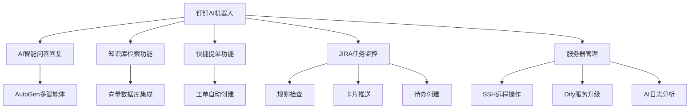

# 钉钉AI机器人

## 📝 项目概述

一个基于钉钉开放平台的智能机器人系统，集成AI问答、知识库检索、JIRA任务管理和服务器维护功能。使用Python 3.12和FastAPI构建，采用微软AutoGen框架实现智能化交互。

## 🚀 主要功能



### 核心功能

1. **机器人AI智能问答和回复**
   - 基于微软AutoGen多智能体架构
   - 支持上下文理解和连续对话

2. **知识库检索问答**
   - 支持对接企业知识库
   - 提供精准信息检索和回答

3. **快捷提单功能**
   - 群聊中快速创建工单
   - 自定义模板支持

4. **JIRA任务管理**
   - 定时检查JIRA任务规范性
   - 群内推送卡片通知
   - 自动创建相关人员待办

5. **服务器维护助手**
   - SSH远程操作支持
   - Dify服务自动化升级
   - AI驱动的日志分析与总结

## 🛠️ 技术架构

- **后端框架**：FastAPI
- **智能体引擎**：Microsoft AutoGen
- **依赖管理**：uv (Python包管理工具)
- **开发环境**：Python 3.12+
- **平台集成**：钉钉开放平台、JIRA API

## 🔧 安装与配置

### 环境要求

- Python 3.12+
- uv (推荐的包管理工具)

### 安装步骤

1. 克隆仓库

```bash
git clone [仓库地址]
cd dingtalk-ai-robot
```

2. 安装依赖

```bash
# 使用uv安装依赖
uv pip install -e .

# 或者使用传统方式
uv pip compile pyproject.toml -o requirements.txt
pip install -r requirements.txt
```

3. 配置环境变量

创建`.env`文件，参考`.env.example`中的示例，配置必要的环境变量。

### 启动服务

```bash
# 使用uv运行
uv run -m app.main

# 或者使用传统方式
python -m app.main
```

## 📚 使用指南

### 机器人配置

1. 在[钉钉开发者平台](https://open-dev.dingtalk.com)创建机器人应用
2. 配置机器人权限和回调地址
3. 获取ClientID、ClientSecret和RobotCode

### 功能使用

1. **AI问答**：在群聊中@机器人并提问
2. **知识库检索**：使用特定指令触发知识库搜索
3. **提单功能**：按格式发送提单信息
4. **JIRA管理**：系统自动执行定时检查
5. **服务器维护**：使用指定命令触发服务器操作

## 🧩 项目结构

```
dingtalk-ai-robot/
├── app/                    # 主应用目录
│   ├── api/                # API端点
│   ├── core/               # 核心配置和功能
│   ├── services/           # 服务模块
│   │   ├── ai/             # AI智能体
│   │   ├── dingtalk/       # 钉钉API集成
│   │   ├── jira/           # JIRA服务
│   │   ├── knowledge/      # 知识库服务
│   │   └── ssh/            # SSH服务
│   └── main.py             # 应用入口
├── tests/                  # 测试目录
├── .env.example            # 环境变量示例
├── pyproject.toml          # 项目配置和依赖
├── CHANGELOG.md            # 变更日志
└── README.md               # 项目说明
```

## 📋 开发计划

- [ ] 机器人AI智能问答和回复
- [ ] 机器人问答可以对接知识库进行检索回复
- [ ] 快捷提单功能的集成
- [ ] 定时检查组内JIRA单符合标准规则
  - [ ] 群内推送卡片形态
  - [ ] 创建对应人的待办
- [ ] 对话机器人可以自动智能升级多台服务器的Dify服务

## 🤝 贡献指南

欢迎提交问题报告、功能请求或代码贡献。请确保遵循项目的代码规范和提交流程。

## 📄 许可证

[MIT License](LICENSE)
