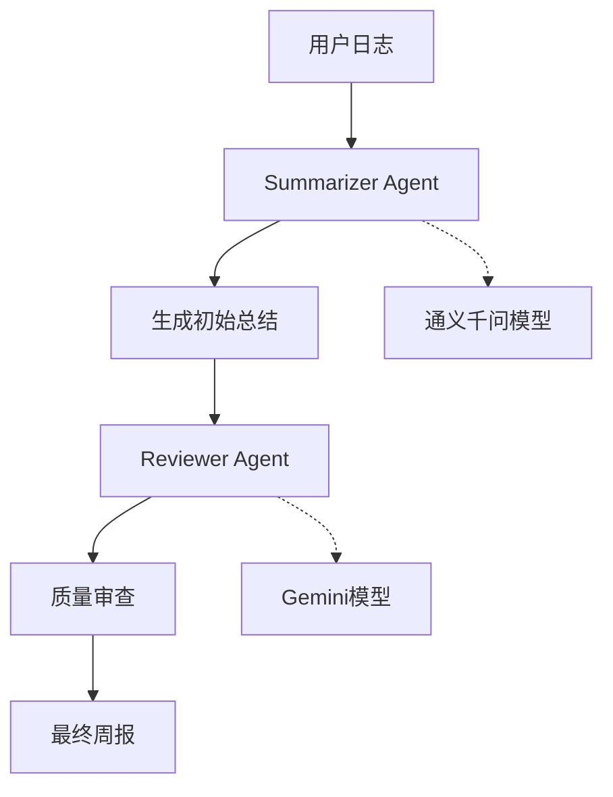

# Gemini 模型集成指南

## 📋 概述

本项目已集成Google Gemini大语言模型，为周报智能体提供更强大的审查能力。通过混合模型架构，实现了：

- **Summarizer智能体**: 使用通义千问模型进行内容总结
- **Reviewer智能体**: 使用Gemini模型进行质量审查

## 🔧 配置步骤

### 1. 获取Gemini API密钥

1. 访问 [Google AI Studio](https://aistudio.google.com/)
2. 创建新项目或选择现有项目
3. 生成API密钥
4. 复制API密钥备用

### 2. 环境变量配置

在项目根目录的 `.env` 文件中添加：

```bash
# Google Gemini API配置
GEMINI_API_KEY=your_gemini_api_key_here
```

### 3. 验证配置

运行测试脚本验证集成是否成功：

```bash
# 使用uv运行测试
uv run python tests/test_gemini_integration.py

# 或使用python直接运行
python tests/test_gemini_integration.py
```

## 🏗️ 技术架构

### 模型客户端架构

```python
# OpenAI客户端（通义千问）
openai_client = get_openai_client()

# Gemini客户端（OpenAI兼容API）
gemini_client = get_gemini_client()
```

### 双智能体协作



## 🔄 容错机制

当Gemini API密钥未配置时，系统会自动降级：

1. **检测API密钥**: 检查`GEMINI_API_KEY`环境变量
2. **自动降级**: 如果未配置，Reviewer智能体将使用默认的OpenAI客户端
3. **日志提示**: 记录降级信息，便于调试

```python
# 自动降级逻辑
if not valid_config.get("api_key"):
    logger.warning("未配置 GEMINI_API_KEY，将使用默认 OpenAI 客户端")
    return get_openai_client(**overrides)
```

## 📊 性能对比

| 指标 | 单模型架构 | 混合模型架构 |
|------|------------|--------------|
| 内容质量 | ⭐⭐⭐ | ⭐⭐⭐⭐⭐ |
| 审查严格度 | ⭐⭐⭐ | ⭐⭐⭐⭐⭐ |
| 响应速度 | ⭐⭐⭐⭐ | ⭐⭐⭐ |
| 成本控制 | ⭐⭐⭐⭐⭐ | ⭐⭐⭐ |

## 🧪 测试用例

### 基础功能测试

```python
# 测试Gemini客户端
async def test_gemini_client():
    client = get_gemini_client()
    response = await client.create([UserMessage(content="测试消息", source="user")])
    assert response.content
```

### 周报生成测试

```python
# 测试混合模型周报生成
async def test_weekly_report():
    agent = WeeklyReportAgent()
    summary = await agent.generate_weekly_summary(test_logs)
    assert summary and len(summary) > 100
```

## 🔍 故障排除

### 常见问题

1. **API密钥无效**
   ```
   错误: Authentication failed
   解决: 检查GEMINI_API_KEY是否正确配置
   ```

2. **网络连接问题**
   ```
   错误: Connection timeout
   解决: 检查网络连接和防火墙设置
   ```

3. **配额限制**
   ```
   错误: Quota exceeded
   解决: 检查API使用配额，考虑升级计划
   ```

### 调试模式

启用详细日志输出：

```python
import logging
logging.getLogger("app.services.ai").setLevel(logging.DEBUG)
```

## 📈 使用统计

运行以下命令查看模型使用情况：

```bash
# 查看周报生成日志
tail -f logs/app.log | grep "WeeklyReportAgent"

# 查看模型客户端日志
tail -f logs/app.log | grep "model_client"
```

## 🚀 未来规划

- [ ] 支持更多Gemini模型版本（Pro、Ultra）
- [ ] 实现模型性能监控和统计
- [ ] 添加模型切换的动态配置
- [ ] 优化混合模型的成本控制策略

## 📞 技术支持

如遇到问题，请：

1. 查看项目日志文件 `logs/app.log`
2. 运行测试脚本进行诊断
3. 检查环境变量配置
4. 提交Issue到项目仓库

---

*最后更新: 2025-07-12*
