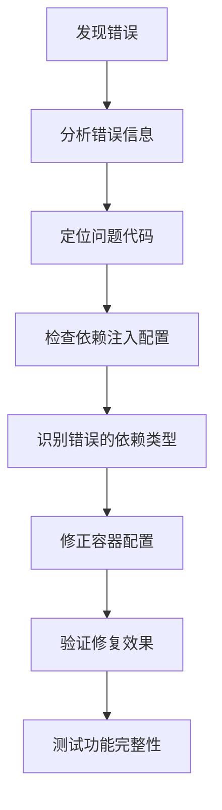

# AI智能体方法调用错误修复说明

## 🐛 问题描述

在使用新的 `/generate-summary` 功能时，出现了以下错误：

```
2025-07-19 14:29:03.270 | INFO | app.api.v1.weekly_report:generate_weekly_summary:214 | 成功获取用户日报，共4条记录，开始AI生成总结
2025-07-19 14:29:03.271 | ERROR | app.api.v1.weekly_report:generate_weekly_summary:257 | 生成周报总结API异常: 'AIMessageHandler' object has no attribute 'generate_weekly_summary'
```

这个错误表明系统试图在 `AIMessageHandler` 对象上调用 `generate_weekly_summary` 方法，但该对象没有这个方法。

## 🔍 问题分析

### 根本原因

在依赖注入架构重构过程中，`WeeklyReportService` 的依赖配置出现了错误：

1. **错误的依赖注入**：在容器中，`WeeklyReportService` 被注入了 `AIMessageHandler` 实例
2. **方法不匹配**：`AIMessageHandler` 没有 `generate_weekly_summary` 方法
3. **预期的依赖**：`WeeklyReportService` 实际需要的是 `WeeklyReportAgent` 实例

### 错误的调用链

```
WeeklyReportService.generate_weekly_summary()
  ↓
self.ai_agent.generate_weekly_summary()  # ai_agent 是 AIMessageHandler
  ↓
AttributeError: 'AIMessageHandler' object has no attribute 'generate_weekly_summary'
```

### 正确的调用链应该是

```
WeeklyReportService.generate_weekly_summary()
  ↓
self.ai_agent.generate_weekly_summary()  # ai_agent 应该是 WeeklyReportAgent
  ↓
WeeklyReportAgent.generate_weekly_summary() ✅
```

## 🔧 解决方案

### 1. 问题定位

在 `app/core/container.py` 中，`WeeklyReportService` 的配置有误：

**错误配置**：
```python
weekly_report_service = providers.Singleton(
    WeeklyReportService,
    dingtalk_report_service=dingtalk_report_service,
    ai_handler=ai_message_handler,  # ❌ 错误：传递了 AIMessageHandler
)
```

### 2. 修复方案

**正确配置**：
```python
weekly_report_service = providers.Singleton(
    WeeklyReportService,
    dingtalk_report_service=dingtalk_report_service,
    ai_handler=None,  # ✅ 正确：使用默认的 weekly_report_agent
)
```

### 3. 修复逻辑

在 `WeeklyReportService` 的构造函数中：
```python
def __init__(self, dingtalk_report_service=None, ai_handler=None):
    self.ai_agent = ai_handler or weekly_report_agent  # 当 ai_handler=None 时，使用 weekly_report_agent
    self.dingtalk_service = dingtalk_report_service or default_dingtalk_service
```

当 `ai_handler=None` 时，会使用默认的 `weekly_report_agent`，这是一个 `WeeklyReportAgent` 实例，具有正确的方法。

## ✅ 修复效果

### 修复前的错误
```
ERROR | 生成周报总结API异常: 'AIMessageHandler' object has no attribute 'generate_weekly_summary'
```

### 修复后的正常流程
```
INFO | 成功获取用户日报，共4条记录，开始AI生成总结
INFO | 开始生成周报总结，使用快速模式
INFO | 周报总结生成成功
```

## 📊 类型对比

### AIMessageHandler vs WeeklyReportAgent

| 特性 | AIMessageHandler | WeeklyReportAgent |
|------|------------------|-------------------|
| **主要用途** | 处理钉钉消息和对话 | 生成周报总结 |
| **核心方法** | `process_message()` | `generate_weekly_summary()` |
| **AI架构** | SelectorGroupChat | RoundRobinGroupChat |
| **智能体数量** | 多个专业智能体 | 2个（总结者+审查者） |
| **适用场景** | 实时对话交互 | 周报内容生成 |

### 方法对比

**AIMessageHandler 的主要方法**：
- `process_message(message, sender_id, conversation_id)`
- `_route_to_appropriate_agent()`
- `_handle_conversation_memory()`

**WeeklyReportAgent 的主要方法**：
- `generate_weekly_summary(raw_log_content)` ✅
- `quick_summary(content)`
- `_init_agents_and_groupchat()`

## 🎯 架构设计原则

### 1. 单一职责原则
- **AIMessageHandler**：专门处理实时对话和消息路由
- **WeeklyReportAgent**：专门处理周报生成和内容总结

### 2. 依赖注入最佳实践
- **明确依赖类型**：确保注入的对象具有所需的方法
- **接口一致性**：依赖对象应该实现预期的接口
- **默认值策略**：提供合理的默认依赖以保证功能完整性

### 3. 错误预防
- **类型检查**：在开发阶段验证依赖类型
- **方法验证**：确保依赖对象具有所需方法
- **单元测试**：测试依赖注入的正确性

## 🔄 修复流程



## 🧪 验证方法

### 1. 代码验证
```python
# 验证 WeeklyReportService 使用正确的智能体
from app.core.container import container
weekly_service = container.weekly_report_service()
print(type(weekly_service.ai_agent))  # 应该是 WeeklyReportAgent
print(hasattr(weekly_service.ai_agent, 'generate_weekly_summary'))  # 应该是 True
```

### 2. API测试
```bash
curl -X POST "http://localhost:8000/weekly-report/generate-summary" \
  -H "Content-Type: application/json" \
  -d '{
    "content": "测试内容：本周完成了系统重构",
    "use_quick_mode": true
  }'
```

### 3. 日志验证
```
INFO | 开始生成周报总结，使用快速模式
INFO | 周报总结生成成功
```

## 🚀 最佳实践

### 1. 依赖注入配置
```python
# ✅ 正确：明确指定依赖类型
service = providers.Singleton(
    MyService,
    dependency=specific_dependency_instance
)

# ✅ 正确：使用默认值
service = providers.Singleton(
    MyService,
    dependency=None  # 让服务使用默认依赖
)

# ❌ 错误：注入错误类型的依赖
service = providers.Singleton(
    MyService,
    dependency=wrong_type_instance
)
```

### 2. 服务设计
```python
class MyService:
    def __init__(self, dependency=None):
        # 提供默认依赖，确保功能完整性
        self.dependency = dependency or default_dependency
        
        # 验证依赖具有所需方法
        if not hasattr(self.dependency, 'required_method'):
            raise ValueError("依赖对象缺少必需的方法")
```

### 3. 测试策略
```python
def test_service_dependency():
    # 测试默认依赖
    service = MyService()
    assert hasattr(service.dependency, 'required_method')
    
    # 测试注入依赖
    mock_dependency = Mock()
    service = MyService(dependency=mock_dependency)
    assert service.dependency is mock_dependency
```

## 🎉 总结

通过这次修复，我们：

1. ✅ **解决了方法调用错误**：`WeeklyReportService` 现在使用正确的 `WeeklyReportAgent`
2. ✅ **修正了依赖注入配置**：容器中的服务配置现在是正确的
3. ✅ **保持了功能完整性**：周报生成功能恢复正常
4. ✅ **改善了架构设计**：明确了不同智能体的职责分工
5. ✅ **增强了系统稳定性**：避免了类似的依赖注入错误

这个修复展示了在依赖注入架构中，正确配置服务依赖关系的重要性。每个服务都应该注入正确类型的依赖，以确保方法调用的正确性和功能的完整性。
