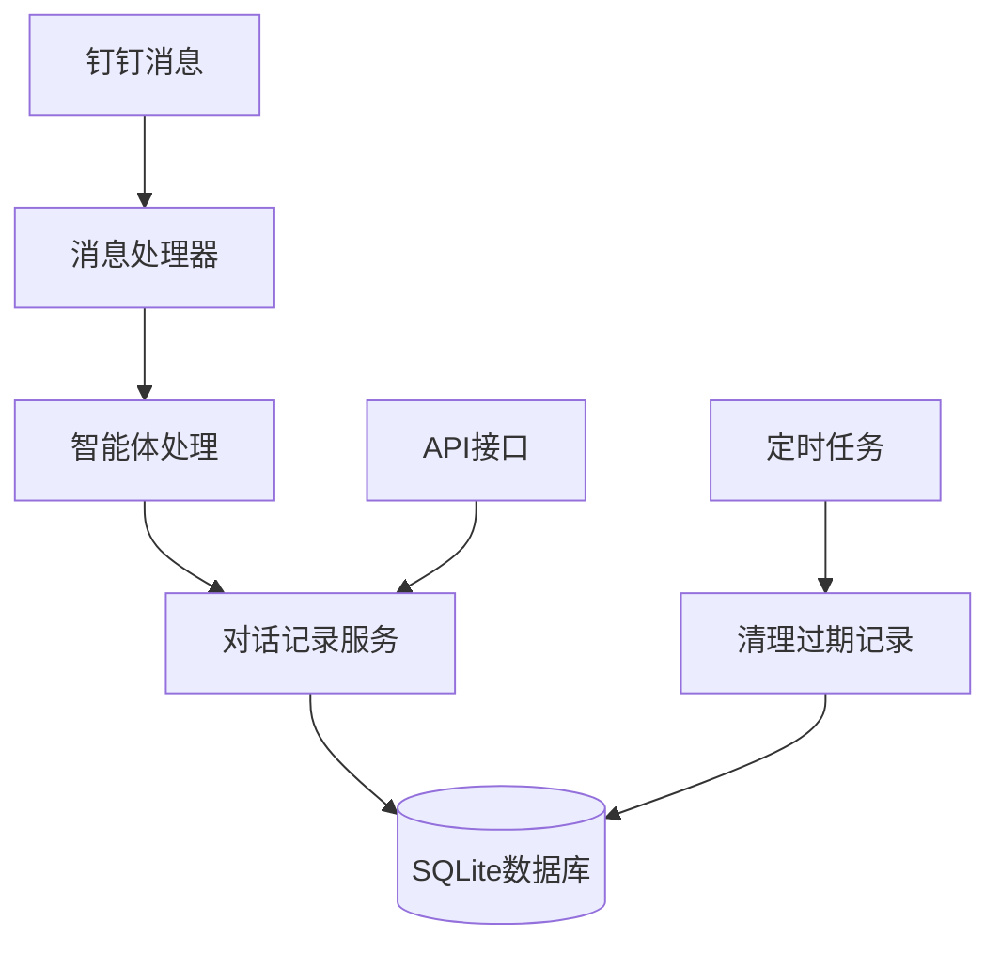

# 对话记录管理功能说明

本文档介绍钉钉AI机器人系统中的对话记录管理功能，包括数据存储、查询、统计、导出和清理等功能。

## 1. 功能概述

对话记录管理模块提供以下核心功能：

- **异步保存**：将用户与AI的对话记录异步保存到数据库
- **历史查询**：支持按会话ID、发送者ID、时间范围等条件查询历史对话
- **统计分析**：提供对话量、响应时间、智能体使用情况等统计数据
- **数据导出**：支持JSON/CSV格式导出对话记录
- **自动清理**：定期清理过期对话记录，减轻数据库负担

## 2. 系统架构



## 3. 数据结构

对话记录表结构：

| 字段名 | 类型 | 说明 |
|-------|-----|------|
| id | INTEGER | 主键 |
| conversation_id | TEXT | 会话ID |
| sender_id | TEXT | 发送者ID |
| user_question | TEXT | 用户问题 |
| ai_response | TEXT | AI回答 |
| message_type | TEXT | 消息类型 |
| response_time_ms | INTEGER | 响应时间(毫秒) |
| agent_type | TEXT | 处理的智能体类型 |
| created_at | TIMESTAMP | 创建时间 |
| updated_at | TIMESTAMP | 更新时间 |

## 4. API接口

### 4.1 查询历史对话

```
GET /api/v1/conversation/history
```

参数：
- `conversation_id`: 会话ID（可选）
- `sender_id`: 发送者ID（可选）
- `limit`: 返回记录数量限制（默认50）
- `offset`: 偏移量（默认0）

### 4.2 获取对话统计

```
GET /api/v1/conversation/stats
```

参数：
- `conversation_id`: 会话ID（可选）
- `sender_id`: 发送者ID（可选）
- `start_date`: 开始日期，格式：YYYY-MM-DD（可选）
- `end_date`: 结束日期，格式：YYYY-MM-DD（可选）

### 4.3 获取最近对话

```
GET /api/v1/conversation/recent
```

参数：
- `hours`: 最近几小时内的对话，默认24小时
- `limit`: 返回记录数量限制（默认100）

### 4.4 获取用户对话摘要

```
GET /api/v1/conversation/user/{user_id}/summary
```

参数：
- `days`: 统计天数，默认7天

### 4.5 清理对话记录

```
POST /api/v1/conversation/cleanup
```

请求体：
```json
{
  "days": 30
}
```

参数：
- `days`: 保留天数，默认30天（删除30天前的记录）

### 4.6 导出对话记录

```
POST /api/v1/conversation/export
```

请求体：
```json
{
  "start_date": "2025-06-01",
  "end_date": "2025-07-01",
  "conversation_id": null,
  "sender_id": null,
  "format": "json"
}
```

参数：
- `start_date`: 开始日期，格式：YYYY-MM-DD（可选）
- `end_date`: 结束日期，格式：YYYY-MM-DD（可选）
- `conversation_id`: 会话ID（可选）
- `sender_id`: 发送者ID（可选）
- `format`: 导出格式，支持json/csv（默认json）

### 4.7 获取统计摘要

```
GET /api/v1/conversation/stats/summary
```

参数：
- `days`: 统计天数，默认30天

## 5. 命令行工具

系统提供了命令行工具用于手动清理对话记录：

```bash
# 清理30天前的对话记录
python -m scripts.cleanup_conversation_logs --days 30

# 仅显示将删除的记录数量，不实际删除
python -m scripts.cleanup_conversation_logs --days 30 --dry-run

# 跳过确认提示直接执行
python -m scripts.cleanup_conversation_logs --days 30 --force
```

## 6. 定时任务

系统配置了定时任务，自动清理过期对话记录：

- 每周一凌晨3点自动清理7天前的对话记录

## 7. 注意事项

1. 保留天数不能少于7天，以防误删重要数据
2. 导出大量数据可能需要较长时间，建议使用过滤条件
3. 对话记录中的敏感信息应妥善处理，避免泄露
4. 数据库操作使用异步线程池，避免阻塞主事件循环

## 8. 故障排除

常见问题：

1. **数据库锁定错误**：SQLite在多线程环境下可能出现锁定，重试操作通常可以解决
2. **导出超时**：导出大量数据时可能超时，建议缩小时间范围或使用过滤条件
3. **清理失败**：检查数据库权限和磁盘空间是否充足
