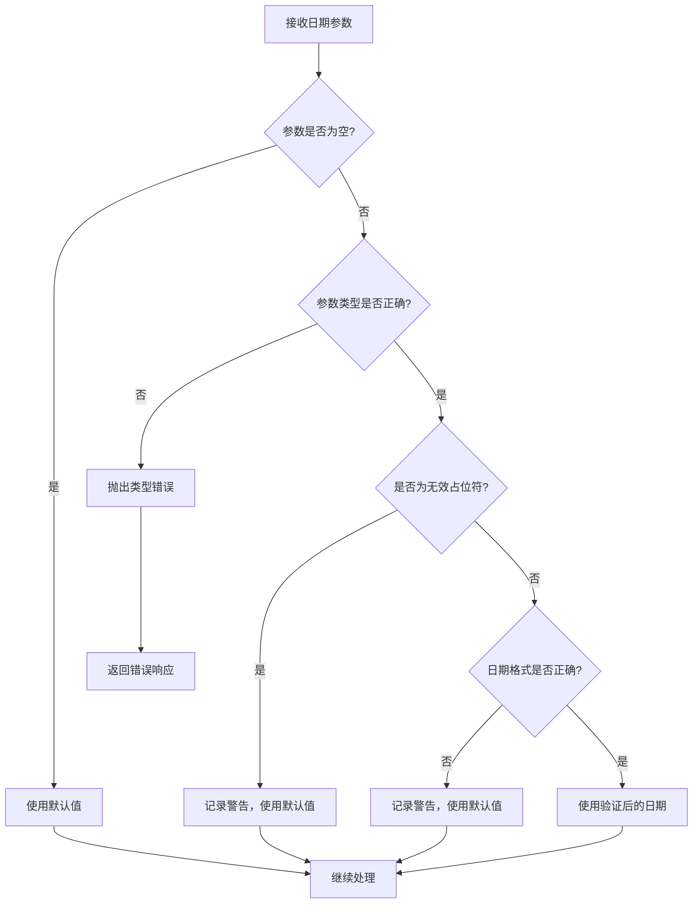

# 日期格式错误修复说明

## 🐛 问题描述

在使用新的 `/generate-summary` 功能时，出现了以下错误：

```
2025-07-19 12:49:13.460 | ERROR | app.services.weekly_report_service:fetch_user_daily_reports:153 | 获取钉钉日报记录时发生错误: time data 'string' does not match format '%Y-%m-%d'
```

这个错误表明在处理日期参数时，代码期望的是 `YYYY-MM-DD` 格式的日期字符串，但实际接收到的是字符串 `'string'`。

## 🔍 问题分析

### 根本原因

1. **API参数传递问题**：在调用 `/generate-summary` 接口时，可能传入了无效的日期值
2. **缺少参数验证**：服务层没有对日期参数进行格式验证
3. **错误处理不完善**：遇到无效日期时没有友好的错误处理机制

### 错误发生位置

在 `app/services/weekly_report_service.py` 的 `fetch_user_daily_reports` 方法中：

```python
# 第88行和第90行
start_timestamp = int(datetime.strptime(start_date, "%Y-%m-%d").timestamp() * 1000)
end_timestamp = int((datetime.strptime(end_date, "%Y-%m-%d") + timedelta(days=1)).timestamp() * 1000)
```

当 `start_date` 或 `end_date` 为 `'string'` 时，`datetime.strptime()` 无法解析，导致异常。

## 🔧 解决方案

### 1. 服务层日期验证增强

在 `fetch_user_daily_reports` 方法中添加了完整的日期验证逻辑：

```python
def validate_date_format(date_str: str, param_name: str) -> str:
    """验证日期格式并返回标准化的日期字符串"""
    if not date_str:
        return None
    
    # 检查是否是有效的日期字符串
    if not isinstance(date_str, str):
        raise ValueError(f"{param_name} 必须是字符串类型，当前类型: {type(date_str)}")
    
    # 检查是否是占位符或无效值
    if date_str.lower() in ['string', 'none', 'null', '']:
        logger.warning(f"检测到无效的{param_name}值: {date_str}，将使用默认值")
        return None
    
    try:
        # 尝试解析日期
        parsed_date = datetime.strptime(date_str, "%Y-%m-%d")
        return parsed_date.strftime("%Y-%m-%d")
    except ValueError as e:
        raise ValueError(f"{param_name} 格式错误，期望格式为YYYY-MM-DD，实际值: {date_str}")
```

### 2. API层参数验证

在 `/generate-summary` 接口中添加了API层面的参数验证：

```python
def validate_api_date(date_str: str, param_name: str) -> str:
    """验证API传入的日期参数"""
    if not date_str:
        return None
    
    # 检查是否是无效值
    if date_str.lower() in ['string', 'none', 'null', '']:
        logger.warning(f"API接收到无效的{param_name}值: {date_str}，将忽略此参数")
        return None
    
    # 验证日期格式
    try:
        from datetime import datetime
        datetime.strptime(date_str, "%Y-%m-%d")
        return date_str
    except ValueError:
        logger.warning(f"API接收到格式错误的{param_name}: {date_str}，期望格式为YYYY-MM-DD，将忽略此参数")
        return None
```

### 3. 错误处理机制

添加了完善的错误处理和友好的错误信息：

```python
try:
    validated_start_date = validate_date_format(start_date, "start_date")
    validated_end_date = validate_date_format(end_date, "end_date")
    
    # 如果验证后的日期为None，使用默认值
    if not validated_start_date or not validated_end_date:
        week_start, _ = self.get_current_week_dates()
        today = get_beijing_time_str(fmt="%Y-%m-%d")
        validated_start_date = validated_start_date or week_start
        validated_end_date = validated_end_date or today
    
    start_date = validated_start_date
    end_date = validated_end_date
    
except ValueError as e:
    logger.error(f"日期验证失败: {e}")
    return {
        "success": False,
        "message": f"日期格式错误: {str(e)}",
        "data": None
    }
```

## ✅ 修复效果

### 修复前的错误
```
ERROR | 获取钉钉日报记录时发生错误: time data 'string' does not match format '%Y-%m-%d'
```

### 修复后的处理

**情况1：传入无效值 'string'**
```
WARNING | 检测到无效的start_date值: string，将使用默认值
INFO | 使用默认日期范围：2025-07-15 到 2025-07-19
```

**情况2：传入错误格式 '2025/07/19'**
```
WARNING | API接收到格式错误的start_date: 2025/07/19，期望格式为YYYY-MM-DD，将忽略此参数
INFO | 使用默认日期范围：2025-07-15 到 2025-07-19
```

**情况3：传入有效日期**
```
INFO | 获取用户 test_user 从 2025-07-15 到 2025-07-19 的日报记录
```

## 🛡️ 防护机制

### 1. 多层验证
- **API层验证**：在接口入口处验证参数
- **服务层验证**：在业务逻辑中再次验证
- **类型检查**：确保参数类型正确

### 2. 容错处理
- **无效值处理**：识别并处理 'string'、'none' 等占位符
- **格式错误处理**：识别并处理错误的日期格式
- **默认值回退**：无效参数时使用合理的默认值

### 3. 友好的错误信息
- **详细的错误描述**：明确指出错误的参数和期望格式
- **日志记录**：记录详细的错误信息用于调试
- **用户友好的响应**：返回易于理解的错误信息

## 📊 处理流程



## 🎯 测试场景

### 1. 无效值测试
```json
{
  "user_id": "test_user",
  "start_date": "string",
  "end_date": "2025-07-19"
}
```
**期望结果**：忽略无效的 start_date，使用默认值

### 2. 错误格式测试
```json
{
  "user_id": "test_user",
  "start_date": "2025/07/19",
  "end_date": "2025-07-19"
}
```
**期望结果**：忽略错误格式的 start_date，使用默认值

### 3. 有效日期测试
```json
{
  "user_id": "test_user",
  "start_date": "2025-07-15",
  "end_date": "2025-07-19"
}
```
**期望结果**：使用提供的有效日期

### 4. 空值测试
```json
{
  "user_id": "test_user"
}
```
**期望结果**：使用默认的本周日期范围

## 🚀 最佳实践

### 1. 参数验证原则
- **早期验证**：在数据进入系统的最早阶段进行验证
- **多层防护**：API层和服务层都要进行验证
- **友好降级**：无效参数时使用合理的默认值

### 2. 错误处理原则
- **详细日志**：记录足够的信息用于调试
- **用户友好**：返回易于理解的错误信息
- **优雅降级**：尽可能继续提供服务而不是直接失败

### 3. 代码健壮性
- **类型检查**：确保参数类型符合预期
- **边界条件**：处理各种边界情况和异常输入
- **向后兼容**：保持API的向后兼容性

## 🎉 总结

通过这次修复，我们：

1. ✅ **解决了日期格式错误**：不再因为无效日期值而崩溃
2. ✅ **增强了参数验证**：多层验证确保数据质量
3. ✅ **改善了错误处理**：友好的错误信息和优雅降级
4. ✅ **提升了系统稳定性**：更好的容错能力和健壮性
5. ✅ **保持了功能完整性**：无效参数时使用合理默认值

现在系统能够正确处理各种日期参数情况，包括无效值、错误格式和空值，大大提升了API的稳定性和用户体验。
