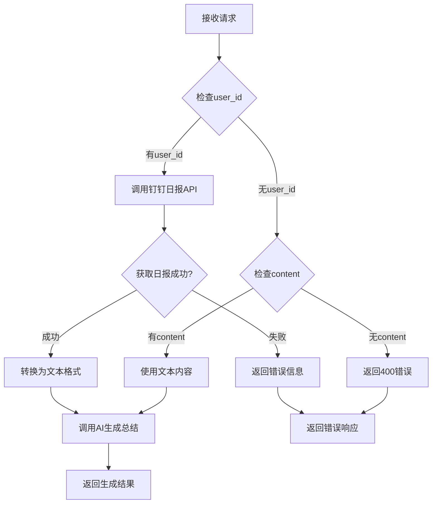

# /generate-summary 功能增强说明

## 🎯 功能需求

根据用户要求，对 `/generate-summary` 功能进行了增强，新增了 `user_id` 参数，实现了两种工作模式：

1. **基于用户ID的自动获取模式**（优先级高）
2. **基于文本内容的总结模式**

## 📋 功能实现

### 1. 请求模型更新

**修改前**：
```python
class GenerateSummaryRequest(BaseModel):
    content: str = Field(..., description="原始日志内容")
    use_quick_mode: bool = Field(False, description="是否使用快速模式")
```

**修改后**：
```python
class GenerateSummaryRequest(BaseModel):
    content: Optional[str] = Field(None, description="原始日志内容（当user_id为空时必填）")
    use_quick_mode: bool = Field(False, description="是否使用快速模式")
    user_id: Optional[str] = Field(None, description="用户ID，优先级高于content，会自动获取用户的钉钉日报记录")
    start_date: Optional[str] = Field(None, description="开始日期，格式为YYYY-MM-DD，仅在使用user_id时有效")
    end_date: Optional[str] = Field(None, description="结束日期，格式为YYYY-MM-DD，仅在使用user_id时有效")
```

### 2. 业务逻辑实现

#### 模式1：基于用户ID自动获取钉钉日报（优先级高）

```python
if request.user_id:
    # 调用钉钉日报获取逻辑
    if request.start_date or request.end_date:
        # 指定日期范围
        daily_reports_result = await weekly_service.fetch_user_daily_reports(
            request.user_id, request.start_date, request.end_date
        )
    else:
        # 默认本周范围
        daily_reports_result = await weekly_service.check_user_weekly_logs(request.user_id)
    
    # 将日报记录转换为文本格式
    content_for_ai = "\n".join([
        f"日期: {report.get('date', '未知')}\n内容: {report.get('content', '无内容')}\n"
        for report in reports_content
    ])
```

#### 模式2：基于文本内容生成总结

```python
else:
    # 直接使用提供的文本内容
    content_for_ai = request.content
```

### 3. 参数验证

```python
if not request.user_id and not request.content:
    raise HTTPException(
        status_code=400, 
        detail="user_id和content至少需要提供一个参数"
    )
```

### 4. 响应数据增强

根据不同模式，在响应中添加相应的元数据：

**基于用户ID模式**：
```json
{
  "success": true,
  "message": "周报总结生成成功",
  "data": {
    "summary": "生成的周报内容...",
    "user_id": "test_user_123",
    "source": "dingtalk_reports",
    "reports_count": 5
  }
}
```

**基于文本内容模式**：
```json
{
  "success": true,
  "message": "周报总结生成成功",
  "data": {
    "summary": "生成的周报内容...",
    "source": "text_content"
  }
}
```

## 🔧 API使用示例

### 示例1：基于用户ID自动获取（推荐）

```bash
curl -X POST "http://localhost:8000/weekly-report/generate-summary" \
  -H "Content-Type: application/json" \
  -d '{
    "user_id": "user123",
    "start_date": "2025-07-14",
    "end_date": "2025-07-18",
    "use_quick_mode": true
  }'
```

### 示例2：基于用户ID（默认本周）

```bash
curl -X POST "http://localhost:8000/weekly-report/generate-summary" \
  -H "Content-Type: application/json" \
  -d '{
    "user_id": "user123",
    "use_quick_mode": true
  }'
```

### 示例3：基于文本内容

```bash
curl -X POST "http://localhost:8000/weekly-report/generate-summary" \
  -H "Content-Type: application/json" \
  -d '{
    "content": "本周工作总结：完成了依赖注入架构重构...",
    "use_quick_mode": true
  }'
```

### 示例4：优先级测试（user_id优先）

```bash
curl -X POST "http://localhost:8000/weekly-report/generate-summary" \
  -H "Content-Type: application/json" \
  -d '{
    "user_id": "user123",
    "content": "这个内容会被忽略",
    "use_quick_mode": true
  }'
```

## 📊 功能特性

### ✅ **优先级机制**
- `user_id` 的优先级高于 `content`
- 如果提供了 `user_id`，将忽略 `content` 参数
- 确保用户意图的明确性

### ✅ **灵活的日期范围**
- 可以指定 `start_date` 和 `end_date` 来限制获取的日报范围
- 如果不指定日期，默认获取本周的日报记录
- 日期格式：`YYYY-MM-DD`

### ✅ **完整的错误处理**
- 参数验证：确保至少提供一个有效参数
- 钉钉API错误处理：获取日报失败时的友好提示
- AI生成错误处理：生成过程中的异常捕获

### ✅ **详细的响应信息**
- 区分不同的数据源（`dingtalk_reports` vs `text_content`）
- 提供用户ID和报告数量等元数据
- 统一的响应格式

## 🔄 工作流程



## 🎯 优势总结

### 1. **用户体验提升**
- 自动化：用户只需提供ID，系统自动获取数据
- 灵活性：支持指定日期范围或使用默认范围
- 便捷性：减少用户手动整理日报的工作量

### 2. **功能完整性**
- 向后兼容：保持原有的文本总结功能
- 功能增强：新增自动获取钉钉日报功能
- 优先级明确：避免参数冲突和歧义

### 3. **技术实现**
- 依赖注入：使用现代化的依赖注入架构
- 错误处理：完善的异常处理和用户友好的错误信息
- 代码复用：复用现有的钉钉日报获取逻辑

## 🚀 后续优化建议

### 1. **缓存机制**
- 对频繁查询的用户日报进行缓存
- 减少钉钉API调用次数
- 提升响应速度

### 2. **批量处理**
- 支持多个用户ID的批量处理
- 团队周报生成功能
- 部门级别的汇总报告

### 3. **模板定制**
- 支持自定义周报模板
- 不同部门的个性化格式
- 多语言支持

### 4. **监控和分析**
- API调用统计
- 生成质量评估
- 用户使用行为分析

## 🎉 总结

通过这次功能增强，`/generate-summary` 接口现在支持：

1. ✅ **智能模式选择**：根据参数自动选择处理模式
2. ✅ **优先级机制**：user_id 优先级高于 content
3. ✅ **灵活的日期控制**：支持自定义日期范围
4. ✅ **完善的错误处理**：友好的错误提示和异常处理
5. ✅ **详细的响应信息**：包含数据源和元数据信息

这个增强功能大大提升了周报生成的自动化程度和用户体验，使得用户可以更便捷地生成高质量的周报总结。
