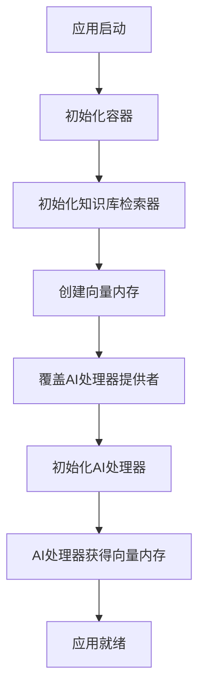

# 向量内存配置修复说明

## 🐛 问题描述

在重新启动应用程序后，出现了以下警告信息：

```
2025-07-19 10:47:02.183 | WARNING  | app.services.ai.handler:__init__:56 | AIMessageHandler initialized without shared vector_memory. Knowledge base functionality will be limited.
```

这个警告表明AI消息处理器没有接收到共享的向量内存，这会限制知识库功能的正常使用。

## 🔍 问题分析

### 根本原因

在依赖注入容器中，AI消息处理器和知识库检索器的初始化存在时序问题：

1. **AI消息处理器**在容器配置时被定义为单例，但此时向量内存还未初始化
2. **知识库检索器**需要异步初始化才能创建向量内存
3. **时序冲突**：AI处理器在知识库检索器完成初始化之前就被创建了

### 原始配置问题

```python
# 问题配置
ai_message_handler = providers.Singleton(
    AIMessageHandler,
    vector_memory=None,  # 此时向量内存还不存在
)
```

## 🔧 解决方案

### 1. 动态配置策略

采用"先初始化知识库，再重新配置AI处理器"的策略：

```python
async def initialize_container():
    # 1. 先初始化知识库检索器
    knowledge_retriever = container.knowledge_retriever()
    await knowledge_retriever.initialize()
    
    # 2. 获取向量内存
    vector_memory = getattr(knowledge_retriever, 'vector_memory', None)
    
    # 3. 重新配置AI处理器提供者
    if vector_memory:
        container.ai_message_handler.override(
            providers.Singleton(
                AIMessageHandler,
                vector_memory=vector_memory
            )
        )
    
    # 4. 初始化AI处理器（现在有向量内存了）
    ai_handler = container.ai_message_handler()
```

### 2. 提供者覆盖机制

使用 `dependency-injector` 的 `override()` 功能：

- **初始配置**：AI处理器提供者配置为 `vector_memory=None`
- **运行时覆盖**：在知识库初始化后，用新的配置覆盖原提供者
- **清理机制**：在容器清理时重置覆盖

### 3. 完整的生命周期管理

```python
async def cleanup_container():
    # 清理知识库检索器
    knowledge_retriever = container.knowledge_retriever()
    if hasattr(knowledge_retriever, 'close'):
        knowledge_retriever.close()
    
    # 重置AI处理器的覆盖
    container.ai_message_handler.reset_override()
```

## ✅ 修复效果

### 修复前
```
2025-07-19 10:47:02.183 | WARNING | AIMessageHandler initialized without shared vector_memory. Knowledge base functionality will be limited.
```

### 修复后
```
2025-07-19 10:58:02.620 | INFO | 🤖 配置AI消息处理器的向量内存...
2025-07-19 10:58:02.621 | INFO | ✅ AI消息处理器向量内存配置成功
2025-07-19 10:58:02.622 | INFO | AIMessageHandler initialized with shared vector_memory.
```

## 🧪 验证测试

### 测试代码
```python
import asyncio
from app.core.container import initialize_container, cleanup_container

async def test():
    success = await initialize_container()
    if success:
        from app.core.container import container
        ai_handler = container.ai_message_handler()
        has_vector_memory = hasattr(ai_handler, 'shared_vector_memory') and ai_handler.shared_vector_memory is not None
        print(f'AI处理器向量内存状态: {has_vector_memory}')
        await cleanup_container()

asyncio.run(test())
```

### 测试结果
```
✅ 容器初始化成功
AI处理器向量内存状态: True
✅ 容器清理完成
```

## 📊 技术细节

### 依赖关系图



### 关键代码变更

1. **容器配置**：保持AI处理器的初始配置简单
2. **初始化逻辑**：添加动态配置步骤
3. **清理逻辑**：确保覆盖被正确重置

## 🎯 学习要点

### 1. 依赖注入的时序问题

在复杂的依赖关系中，服务的初始化顺序很重要：
- **同步依赖**：可以在容器配置时解决
- **异步依赖**：需要在运行时动态配置

### 2. 提供者覆盖的使用

`dependency-injector` 的覆盖功能非常强大：
- **测试场景**：注入Mock对象
- **运行时配置**：动态调整服务配置
- **条件配置**：根据环境或状态选择不同实现

### 3. 生命周期管理

完整的生命周期管理包括：
- **初始化**：正确的启动顺序
- **运行时**：动态配置调整
- **清理**：资源释放和状态重置

## 🚀 最佳实践

### 1. 异步服务的依赖注入

对于需要异步初始化的服务：
```python
# ✅ 推荐：延迟配置
service = providers.Singleton(Service, config=None)

# 在初始化函数中
async def initialize():
    config = await get_async_config()
    container.service.override(providers.Singleton(Service, config=config))
```

### 2. 复杂依赖关系的处理

```python
# ✅ 推荐：分阶段初始化
async def initialize_container():
    # 阶段1：基础服务
    await init_basic_services()
    
    # 阶段2：依赖服务
    await init_dependent_services()
    
    # 阶段3：高级服务
    await init_advanced_services()
```

### 3. 错误处理和回滚

```python
async def initialize_container():
    try:
        # 初始化逻辑
        pass
    except Exception as e:
        # 回滚已初始化的服务
        await cleanup_container()
        raise
```

## 🎉 总结

通过这次修复，我们：

1. ✅ **解决了向量内存配置问题**：AI处理器现在能正确获得向量内存
2. ✅ **改进了依赖注入架构**：支持异步服务的动态配置
3. ✅ **增强了生命周期管理**：完整的初始化和清理流程
4. ✅ **提升了系统稳定性**：消除了功能限制警告

这个修复展示了依赖注入架构在处理复杂依赖关系时的灵活性和强大功能。通过合理使用提供者覆盖机制，我们可以在运行时动态调整服务配置，确保所有服务都能获得正确的依赖。
