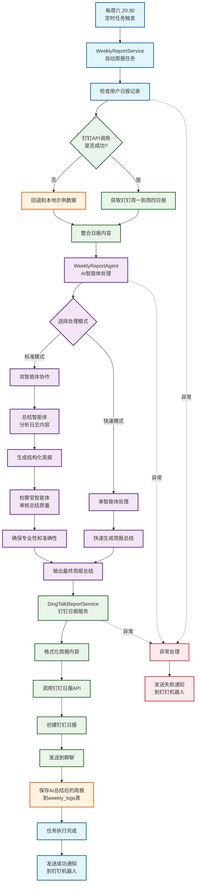
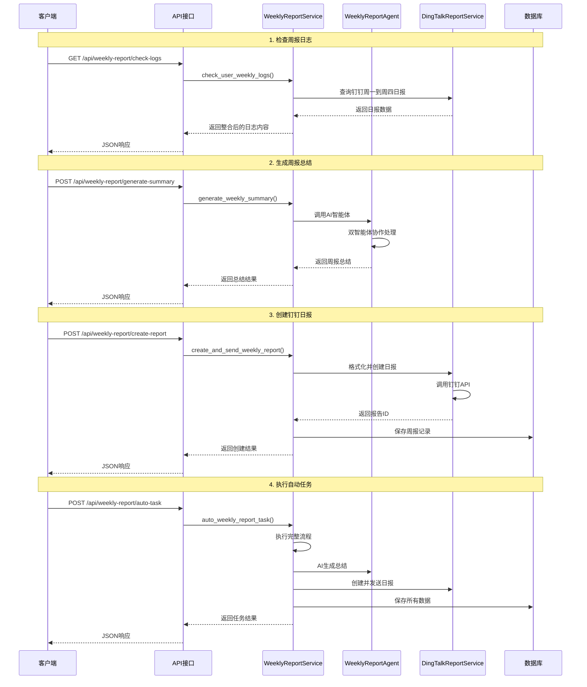
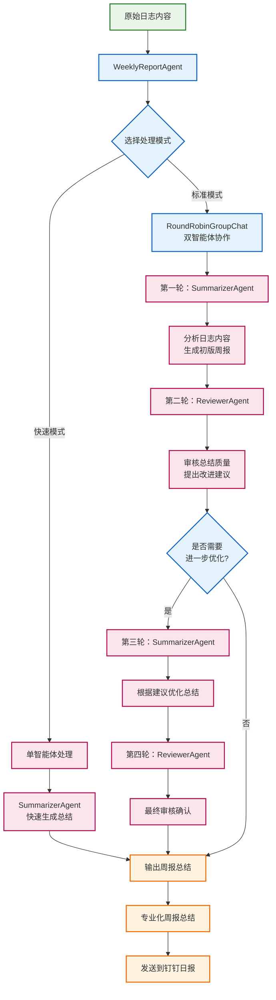

# 📊 周报管理系统架构流程图

## 🔄 完整工作流程



## 🏗️ 系统架构组件

```mermaid
graph LR
    %% 核心服务层
    subgraph "核心服务层"
        A[WeeklyReportService<br/>周报业务逻辑]
        B[DingTalkReportService<br/>钉钉API封装]
        C[WeeklyReportAgent<br/>AI智能体服务]
    end

    %% 数据层
    subgraph "数据持久层"
        D[(SQLite数据库<br/>weekly_logs表)]
        E[日志文件系统]
    end

    %% AI智能体层
    subgraph "AI智能体层"
        F[总结智能体<br/>SummarizerAgent]
        G[检察官智能体<br/>ReviewerAgent]
        H[AutoGen<br/>RoundRobinGroupChat]
    end

    %% 外部API层
    subgraph "外部API层"
        I[钉钉日报API]
        J[钉钉机器人API]
    end

    %% API接口层
    subgraph "API接口层"
        K[/api/weekly-report/check-dingding-logs]
        L[/api/weekly-report/generate-summary]
        M[/api/weekly-report/create-report]
        N[/api/weekly-report/auto-task]
    end

    %% 定时任务层
    subgraph "定时任务层"
        O[Scheduler调度器]
        P[每周六20:30<br/>定时触发]
    end

    %% 连接关系
    A --> D
    A --> C
    A --> B
    B --> I
    B --> J
    C --> F
    C --> G
    C --> H
    F --> H
    G --> H
    K --> A
    L --> A
    M --> A
    N --> A
    O --> P
    P --> A

    %% 样式定义
    classDef serviceBox fill:#e3f2fd,stroke:#1976d2,stroke-width:2px
    classDef dataBox fill:#f1f8e9,stroke:#388e3c,stroke-width:2px
    classDef aiBox fill:#fce4ec,stroke:#c2185b,stroke-width:2px
    classDef apiBox fill:#fff8e1,stroke:#f57c00,stroke-width:2px
    classDef scheduleBox fill:#f3e5f5,stroke:#7b1fa2,stroke-width:2px

    class A,B,C serviceBox
    class D,E dataBox
    class F,G,H aiBox
    class I,J,K,L,M,N apiBox
    class O,P scheduleBox
```

## 📋 API接口调用流程



## 🎯 智能体协作机制



## 🔧 配置和部署

### 环境变量配置

```bash
# 钉钉相关配置
DINGTALK_CLIENT_ID=your_client_id
DINGTALK_CLIENT_SECRET=your_client_secret
DINGTALK_ROBOT_CODE=your_robot_code

# AI模型配置
OPENAI_API_KEY=your_openai_key
GEMINI_API_KEY=your_gemini_key

# 数据库配置
DATABASE_PATH=./data/dingtalk_ai_robot.db
```

### 定时任务配置

系统默认配置每周六20:30执行周报生成任务，可在 `app/core/scheduler.py` 中修改：

```python
# 每周六20:30执行周报生成任务
schedule.every().saturday.at("20:30").do(lambda: asyncio.create_task(weekly_report_task()))
```

### 测试和验证

使用提供的测试脚本验证功能：

```bash
# 运行周报功能测试
uv run -m test_weekly_report

# 启动服务
uv run -m app.main

# 手动触发周报任务
curl -X POST http://localhost:8000/api/weekly-report/auto-task
```
